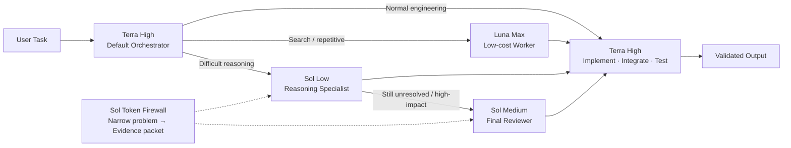

# agent-routing-gpt

Codex에서 **성능을 유지하면서 불필요한 고비용 모델 사용을 줄이기 위한 멀티 에이전트 라우팅 템플릿**입니다.

## Architecture



**Routing principle:** Luna handles cheap bounded work, Terra owns normal engineering and integration, and Sol is used only after the problem has been narrowed.


---

## Why this project exists

큰 코드베이스에서 Codex를 사용할 때 한 가지 모델만 계속 쓰면 두 가지 문제가 생깁니다.

- **Sol을 기본 모델로 사용하면** 복잡한 추론과 디버깅 성능은 좋지만, repository 탐색·로그 확인·반복 작업까지 Sol이 수행하면서 사용량이 빠르게 증가할 수 있습니다.
- **Luna만 사용하면** 검색·반복 작업은 효율적이지만, 복잡한 원인 분석이나 architecture 수준의 판단에서는 원하는 수준의 결과가 나오지 않을 수 있습니다.

그래서 이 프로젝트는 하나의 모델을 고정해서 쓰는 대신, **작업의 성격과 난이도에 따라 적절한 하위 에이전트로 위임하고 필요할 때만 상위 모델로 승격(escalation)**하도록 구성했습니다.

기본 흐름은 다음과 같습니다.

```text
Luna Max
   ↓
Terra High
   ↓
Sol Low
   ↓
Sol Medium
```

핵심 아이디어는 단순합니다.

- **Luna Max** — 저비용 탐색, 검색, 반복 작업
- **Terra High** — 기본 구현, 통합, 디버깅, 테스트
- **Sol Low** — 충분히 좁혀진 고난도 문제 분석
- **Sol Medium** — architecture / research-critical / unresolved 문제의 최종 검토

즉, Sol을 기본 작업자가 아니라 **고비용 reasoning specialist / reviewer**로 사용합니다.

---

## Goals

이 템플릿의 목표는 다음과 같습니다.

1. 일반적인 개발 성능은 Terra 중심으로 유지
2. 단순 탐색과 반복 작업은 Luna에 위임
3. Sol 호출 전에 문제와 context를 먼저 압축
4. Sol이 repository 전체를 다시 읽는 상황 최소화
5. 어려운 문제에서만 Sol의 reasoning capability 사용
6. 여러 subagent가 무분별하게 동시에 실행되는 것을 방지
7. 연구 코드에서는 실행 성공과 scientific validity를 구분

---

## Repository structure

```text
agent-routing-gpt/
├── README.md
├── AGENTS.md
└── .codex/
    ├── config.toml
    └── agents/
        ├── luna_max.toml
        ├── terra_high.toml
        ├── sol_low.toml
        └── sol_medium.toml
```

| File | Purpose |
|---|---|
| `AGENTS.md` | 전체 routing, escalation, token-control 규칙 |
| `.codex/config.toml` | 기본 모델 및 subagent 설정 |
| `.codex/agents/luna_max.toml` | 검색·반복 작업 전용 agent |
| `.codex/agents/terra_high.toml` | 기본 software engineering agent |
| `.codex/agents/sol_low.toml` | 고난도 문제 분석용 specialist |
| `.codex/agents/sol_medium.toml` | 고위험 문제 최종 reasoning/review agent |

---

## Routing policy

### Luna Max

명확하고 범위가 좁은 작업에 사용합니다.

예:

- repository/file discovery
- symbol / call-site search
- 로그 및 error 추출
- 반복적인 수정
- boilerplate 생성
- rename / formatting
- 간단한 configuration 변경
- 단순 테스트 실행
- 문서 업데이트

Luna는 가능한 한 **원시 출력 전체를 넘기지 않고 짧게 요약**해서 상위 agent에 전달합니다.

### Terra High

기본 orchestrator이자 implementation agent입니다.

예:

- feature implementation
- multi-file changes
- debugging
- refactoring
- tests
- model / dataset pipeline
- loss / metric
- training / evaluation
- ONNX / export
- integration

모델 선택이 애매하면 Terra를 기본값으로 사용합니다.

### Sol Low

Terra가 문제를 충분히 좁힌 뒤에도 해결하기 어려울 때만 사용합니다.

예:

- 여러 plausible root cause가 남아 있는 bug
- cross-module interaction
- numerical instability
- loss interaction
- training collapse
- inference discrepancy
- 예상하기 어려운 model behavior

Sol Low는 가능한 한 **read-only consultant**로 사용합니다.

### Sol Medium

다음과 같은 고위험 문제에서만 사용합니다.

- Sol Low로도 결론이 나지 않은 문제
- major architecture decision
- experimental validity에 영향을 주는 문제
- synthetic-data methodology 검증
- 논문 결과에 영향을 줄 수 있는 data/model assumption
- 큰 downstream cost가 발생하는 변경 전 최종 검토

---

## Sol Token Firewall

이 프로젝트의 가장 중요한 규칙입니다.

Sol을 호출하기 전에 Luna/Terra가 먼저 문제를 좁히고 다음과 같은 **compact evidence packet**을 준비합니다.

1. 정확히 답해야 할 질문
2. 현재 관찰된 동작
3. 기대 동작
4. 최소한의 관련 파일
5. 관련 함수 / 클래스
6. 필요한 로그 / error excerpt
7. 이미 수행한 테스트
8. 현재 hypothesis

### Avoid

```text
Sol
→ repository 전체 탐색
→ 대량 로그 읽기
→ 문제 발견
→ 코드 수정
→ 광범위 테스트
```

### Prefer

```text
Luna
→ 파일 / 로그 탐색

Terra
→ 문제 재현
→ 원인 후보 축소
→ evidence 정리

Sol
→ 좁혀진 문제 reasoning

Terra
→ 구현
→ 테스트
→ 통합
```

즉:

> **cheap exploration → distilled evidence → expensive reasoning**

순서를 유지합니다.

---

## Escalation policy

```text
Luna Max
   │
   │ ambiguous / interacting components
   ▼
Terra High
   │
   │ failed verification / competing root causes
   ▼
Sol Low
   │
   │ unresolved / high-impact
   ▼
Sol Medium
```

### Luna → Terra

다음 경우 escalation합니다.

- 요구사항이 모호함
- architectural judgment가 필요함
- 여러 component가 상호작용함
- correctness를 충분히 검증하기 어려움

### Terra → Sol Low

다음 경우 escalation합니다.

- Terra의 진단이 verification에서 실패함
- evidence가 현재 explanation과 모순됨
- 여러 credible root cause가 남아 있음
- 더 강한 reasoning이 실질적으로 필요한 문제임

**작업이 크다는 이유만으로 Sol을 호출하지 않습니다.**

### Sol Low → Sol Medium

다음 경우에만 escalation합니다.

- Sol Low가 inconclusive
- verification이 Sol Low 분석과 모순됨
- architecture-critical / research-critical / high-impact 문제임

---

## How to use

### 1. Project-level 사용

이 저장소의 다음 항목을 Codex를 사용하는 프로젝트 root에 복사합니다.

```text
your-project/
├── AGENTS.md
└── .codex/
    ├── config.toml
    └── agents/
        ├── luna_max.toml
        ├── terra_high.toml
        ├── sol_low.toml
        └── sol_medium.toml
```

이후 해당 repository에서 Codex를 실행하면 프로젝트 단위 routing policy로 사용할 수 있습니다.

### 2. 기존 AGENTS.md가 있는 경우

기존 내용을 덮어쓰지 말고, 이 저장소의 `AGENTS.md`에서 **Agent Routing Policy / Sol Token Firewall / Escalation Policy** 부분만 기존 파일에 병합하는 것을 권장합니다.

### 3. Global agent로 재사용하고 싶은 경우

여러 프로젝트에서 동일한 custom agent를 사용하려면 agent TOML 파일을 사용자 전역 Codex agent 디렉터리로 옮겨 사용할 수 있습니다.

프로젝트별 규칙은 각 repository의 `AGENTS.md`에서 관리하는 편이 안전합니다.

---

## Recommended ownership

```text
Luna
  Discovery / repetitive work

Terra
  Implementation / integration / testing

Sol
  Deep reasoning / review
```

Sol이 진단을 마치면 실제 구현은 가능한 한 다시 Terra에게 넘깁니다.

---

## Parallel-agent policy

멀티 에이전트가 가능하다고 해서 항상 병렬 실행하는 것은 아닙니다.

- 서로 독립적인 작업만 parallel 실행
- 여러 검색 작업은 Luna에 분산 가능
- overlapping file edits는 피함
- 같은 문제에 여러 Sol agent를 동시에 사용하지 않음
- 독립적인 high-impact review가 필요한 경우에만 추가 Sol 사용
- 동시 agent 수는 작게 유지
- 결과는 raw dump 대신 요약해서 반환

기본 설정에서는 동시 subagent thread 수를 4개로 제한합니다.

---

## Example workflow

예를 들어 다음 요청이 있다고 가정합니다.

```text
Find the cause of an inference artifact and fix it.
```

권장 흐름:

```text
Terra High
   │
   ├── Luna Max → 관련 파일 탐색
   ├── Luna Max → 로그 / execution path 탐색
   │
   ▼
Terra High
   ├── reproduce
   ├── root cause 후보 축소
   └── targeted tests
   │
   ├── ordinary issue → Terra에서 해결
   │
   └── difficult issue
           ▼
        Sol Low
           │
           └── root-cause reasoning
           ▼
        Terra High
           ├── implement
           └── validate
           │
           └── unresolved + high-impact
                    ▼
                 Sol Medium
```

---

## Research-critical rule

연구 코드에서는 다음을 구분합니다.

- **Implementation correctness**
- **Data correctness**
- **Methodological validity**
- **Scientific interpretation**

코드가 정상 실행되거나 테스트를 통과했다는 사실만으로 연구 방법론이 타당하다고 간주하지 않습니다.

Terra는 구현과 검증을 담당하고, 필요한 경우 Sol Medium이 methodology나 scientific validity를 독립적으로 검토하도록 합니다.

---

## Customization

이 설정은 시작점입니다. 실제 사용 패턴에 따라 조정하는 것을 권장합니다.

예:

- Luna Max가 단순 작업에서도 과도하게 reasoning하면 `high` 또는 `medium`으로 낮추기
- Terra High만으로 대부분 해결된다면 Sol escalation 조건을 더 엄격하게 만들기
- 사용량이 여전히 높다면 correctness check를 줄이기 전에 concurrency부터 줄이기
- main context가 길어지면 subagent의 반환 결과를 더 짧게 제한하기

---

## Philosophy

이 프로젝트의 목표는 항상 가장 강한 모델을 호출하는 것이 아닙니다.

> **Use the cheapest capable agent first, and spend stronger reasoning only when evidence justifies escalation.**

---

## References

- Codex subagents: https://developers.openai.com/codex/subagents
- Codex documentation: https://developers.openai.com/codex/
- OpenAI model documentation: https://developers.openai.com/api/docs/models
